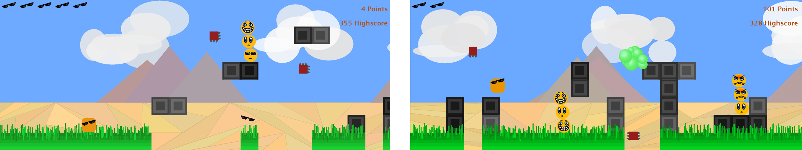
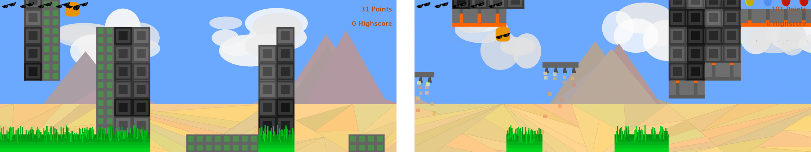
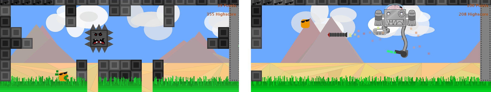

# R&#949;KiT

R&#949;KiT is a platform jumper game in Java and [AWT](https://docs.oracle.com/javase/8/docs/api/java/awt/package-summary.html) and has a self-written game engine to understand and modify.

The project is aiming to educate about software design and was created by students of the [Karlsruher Institut für Technologie](https://www.kit.edu/).

## Getting Started
To simply play the game, download the latest **ReKiT.jar** on the [releases page](https://github.com/rekit-group/rekit-game/releases) and launch by **double clicking** the jar-file.
If double clicking doesn't work, open a terminal and run the command `java -jar <JAR-FILE>` in the correct folder.

## GameModes

### Infinite Mode
The infinite level is randomly assembled from small components that [can be modified](https://github.com/rekit-group/rekit-game/blob/master/project/logic/src/main/resources/levels/infinite.dat) The more varieties through structures and enemies there is, the more random this level becomes!

### Arcade Mode
In contrast to the random infinite mode, there is also a set of predesigned levels to master.
They introduce one special block and feature at a time but will always be challenging!

Levels can also be added via modding as shown in [the example](https://github.com/rekit-group/rekit-sample-mod).

### Boss Rush
The Boss Rush is a quick way to challenge the games bosses, that have [more complex movement and attack patterns](https://github.com/rekit-group/rekit-game/tree/master/project/basic/src/main/java/rekit/logic/gameelements/entities/enemies/bosses/rocketboss) than usual Enemies.

## Features
Currently, the game features
- 7 special blocks
- 12 arcade levels, infinite mode, boss rush mode
- 5 collectable items
- 8 enemies
- 2 bosses

## Development
To setup your workspace for viewing or altering the code follow these steps:
- Have [eclipse](https://www.eclipse.org/downloads/?) with the [Maven Eclipse plugin](http://www.eclipse.org/m2e/) installed
- Clone the repository
- Switch workspace to the main directory (File -> Switch Workspace)
- Import every maven module in this directory (File -> Import -> Maven -> Existing Maven Projects)
- To compile the project click the run button after opening Main.java in the game module

## Mods / Addons
Addons are an easy way to add functionality without understanding the whole code.

Check out this [example project on GitHub](https://github.com/rekit-group/rekit-sample-mod) on how to create an addon.

Also, see this detailed instruction on [adding levels](https://github.com/rekit-group/rekit-game/blob/master/documentation/LEVEL.md).

Here is a list what can be added via addons:

| Addable Feature | Super class and documentation | Example |
| ----- | ----- | ----- |
| Level | - | [Adding levels](https://github.com/rekit-group/rekit-game/blob/master/documentation/LEVEL.md) |
| Enemies | [rekit.logic.gameelements.type.Enemy](https://rekit-group.github.io/rekit-game/rekit/logic/gameelements/type/Enemy.html) | [Cannon](https://github.com/rekit-group/rekit-game/blob/master/project/basic/src/main/java/rekit/logic/gameelements/entities/enemies/cannon/Cannon.java) |
| Special blocks | [rekit.logic.gameelements.type.DynamicInanimate](https://rekit-group.github.io/rekit-game/rekit/logic/gameelements/type/DynamicInanimate.html) | [ClimbUpBox](https://github.com/rekit-group/rekit-game/blob/master/project/basic/src/main/java/rekit/logic/gameelements/inanimate/ClimbUpBox.java) |
| Bosses | [rekit.logic.gameelements.type.Boss](https://rekit-group.github.io/rekit-game/rekit/logic/gameelements/type/Boss.html) | [RocketBoss](https://github.com/rekit-group/rekit-game/blob/master/project/basic/src/main/java/rekit/logic/gameelements/entities/enemies/bosses/rocketboss/RocketBoss.java) |
| Items | [rekit.logic.gameelements.type.Pickup](https://rekit-group.github.io/rekit-game/rekit/logic/gameelements/type/Pickup.html) | [BluePill](https://github.com/rekit-group/rekit-game/blob/master/project/basic/src/main/java/rekit/logic/gameelements/entities/pickups/BluePill.java) |

### Known Mods
- [Sample Mod](https://github.com/rekit-group/rekit-sample-mod)

## Contributors
### Maintainers:
- [**@AnJ95**](https://github.com/AnJ95)
- [**@matzebond**](https://github.com/matzebond)
- [**@dfuchss**](https://github.com/dfuchss)

### Special thanks to contributors:
- [**@Norbert515**](https://github.com/Norbert515)
- [**@Flunzmas**](https://github.com/Flunzmas)
